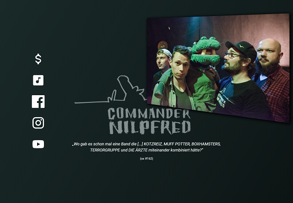
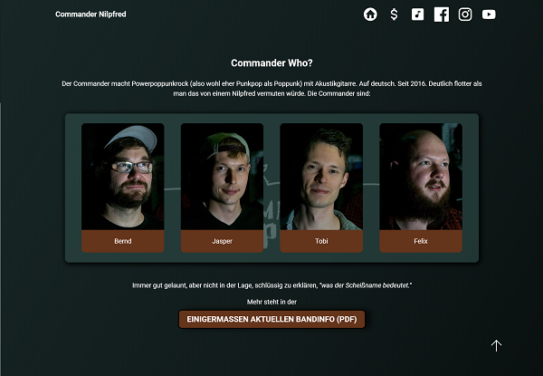
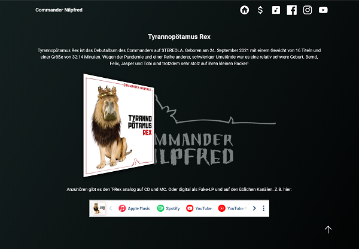
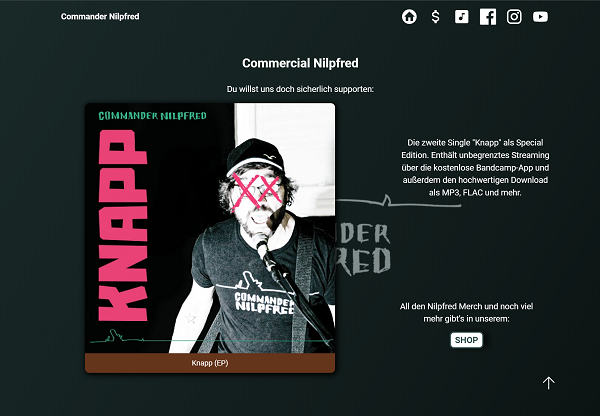
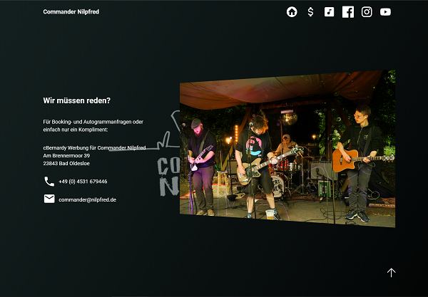
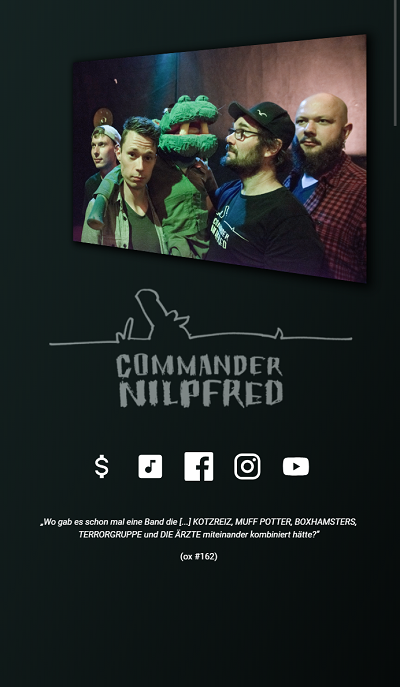
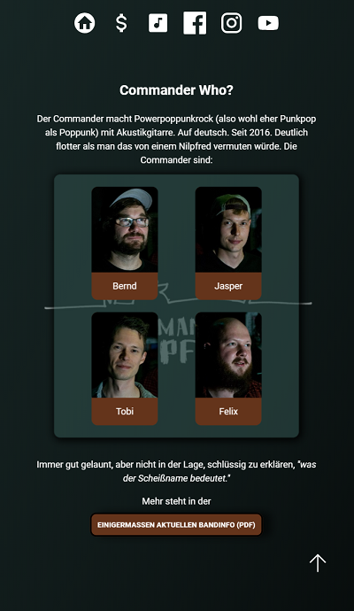
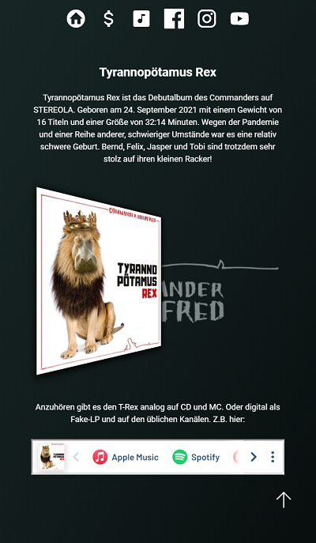
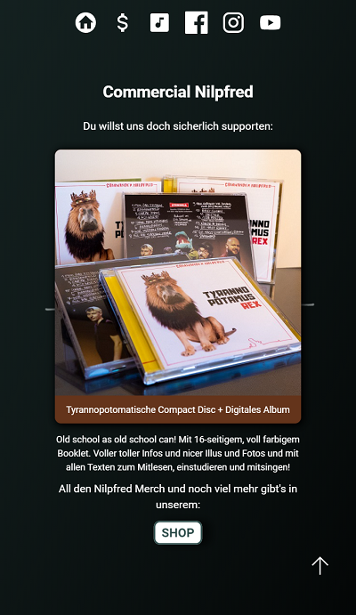
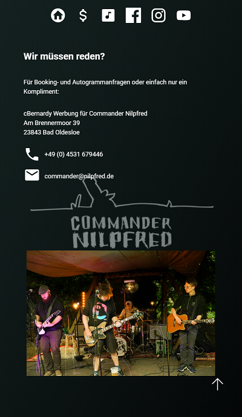

<h1 align="center">Commander Nilpfred Website</h1>

I created a website for my punk rock band with React. Containing a hero, about, music, merch and contact section. As I have a lot of things in mind how to improve this page even more, I'm sure it will change from time to time. For now I think it's quite neat.

<h2>Demo</h2>

[Live Demo](https://nilpfred-website.vercel.app/)

<h2>Built with</h2>

- React
- JavaScript
- CSS
- HTML

 

<h2>Features</h2>

- Navigation via scroll snap
- Full responsiveness for screen sizes larger than 320 px width
- Fixed background logo creating the impression of 3d navigation
- Hero section sliding in different quotes from album reviews
- Animated cards in about section showing instruments played by each person on first view, on hover and on tap
- Turntable-like presentation of debut album cover
- Merch section showing different available items with short description, sliding in and out every few seconds

<h2>Screenshots</h2>
<h3>Desktop</h3>

<h3>Mobile</h3>

<h2>External Resources</h2>

- Icons by <a target="_blank" href="https://devicon.dev/">DEVICON</a> and <a target="_blank" href="https://pictogrammers.com/library/mdi/">Pictogrammers</a>
- Images by <a target="_blank" href="https://fotocommunity.de/fotograf/christoph-schwencke/2216245">Christoph Schwencke</a> and cBernardy Werbung
